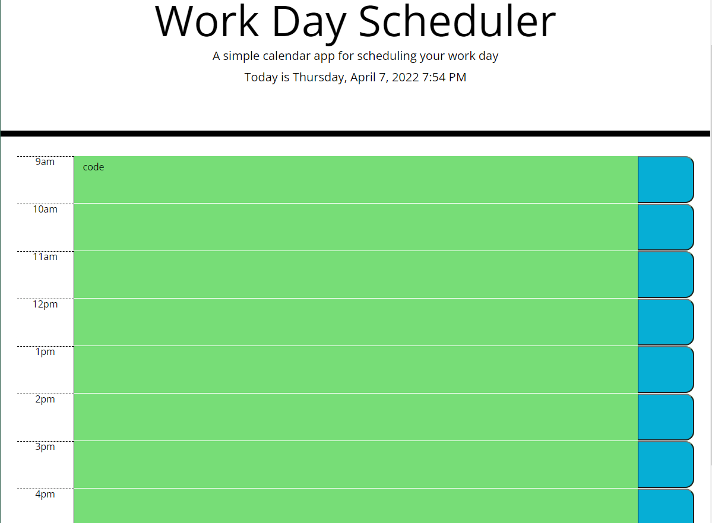

# daily-planner

## Description 

I present to you, a daily planner. This planner was created using mostly JQuery and JavaScript, along with Bootstrap, CSS, and HTML. The current time and date is displayed using Moment. Hours featured are 9am-5pm, and are color coded based on the current time of day: gray for past, red for present, and green for the future. The text area is where any tasks may be entered and saved on your computer's local storage, allowing you to recall tasks after refreshing the page.  As my knowledge of javascript increase I plan on adding more features. 
 
## Usage

Sophia Custodia
[Linkedin](https://www.linkedin.com/in/sophia-custodia/)

[w3School](https://w3schools.com/)

## License

Copyright (c) [2022] [SophiaCustodia]

Permission is hereby granted, free of charge, to any person obtaining a copy
of this software and associated documentation files (the "Software"), to deal
in the Software without restriction, including without limitation the rights
to use, copy, modify, merge, publish, distribute, sublicense, and/or sell
copies of the Software, and to permit persons to whom the Software is
furnished to do so, subject to the following conditions:

The above copyright notice and this permission notice shall be included in all
copies or substantial portions of the Software.

THE SOFTWARE IS PROVIDED "AS IS", WITHOUT WARRANTY OF ANY KIND, EXPRESS OR
IMPLIED, INCLUDING BUT NOT LIMITED TO THE WARRANTIES OF MERCHANTABILITY,
FITNESS FOR A PARTICULAR PURPOSE AND NONINFRINGEMENT. IN NO EVENT SHALL THE
AUTHORS OR COPYRIGHT HOLDERS BE LIABLE FOR ANY CLAIM, DAMAGES OR OTHER
LIABILITY, WHETHER IN AN ACTION OF CONTRACT, TORT OR OTHERWISE, ARISING FROM,
OUT OF OR IN CONNECTION WITH THE SOFTWARE OR THE USE OR OTHER DEALINGS IN THE
SOFTWARE.

